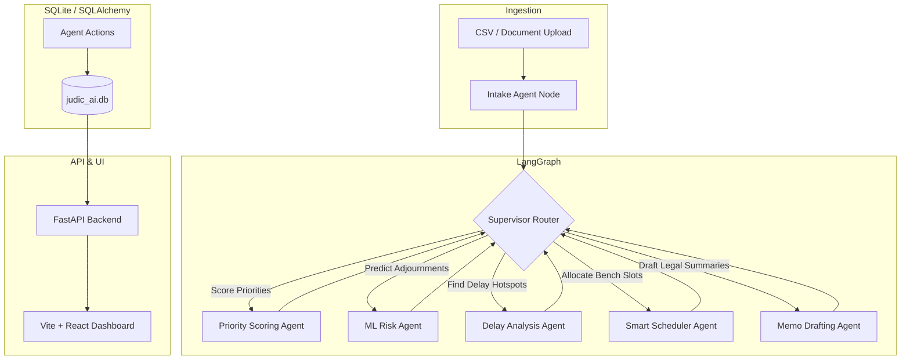

# Project Knowledge: Paradox (JudicAI)

This document is a comprehensive technical map of **Paradox (JudicAI)**. It is designed to help future agentic AI assistants quickly understand the architecture, data models, orchestration logic, and front/back-end setup of the project without consuming excessive tokens.

---

## 🏛️ Architecture & System Design
JudicAI is a judicial backlog intelligence layer. It sits on top of standard court registries, utilizing a FastAPI backend and a Vite+React frontend.



---

## 📂 Codebase Structure
```text
Paradox/
├── backend/
│   ├── app/
│   │   ├── agents/             # LangGraph Multi-Agent Orchestration Nodes
│   │   │   ├── delay/          # Statistical delay analysis pipeline
│   │   │   ├── intake/         # Ingestion, validation, and cleaning
│   │   │   ├── priority/       # Complex priority scoring rules
│   │   │   ├── risk/           # XGBoost-powered adjournment likelihood model
│   │   │   ├── scheduler/      # Smart scheduling via DEAP (Genetic Algorithm)
│   │   │   ├── agent_nodes.py  # LangGraph wrapper nodes
│   │   │   └── memo_agent.py   # LLM/Ollama-based review drafting
│   │   ├── api/                # FastAPI Routers
│   │   │   ├── api_router.py   # API entrypoint router
│   │   │   ├── auth.py         # Login and signup routes
│   │   │   ├── cases.py        # Case CRUD and agent triggering
│   │   │   └── dashboard.py    # Statistical summaries for charts
│   │   ├── core/
│   │   │   ├── security.py     # JWT & Password hashing (Bcrypt)
│   │   │   └── supervisor.py   # LangGraph Supervisor Router state and flow
│   │   ├── db/
│   │   │   ├── migrate_schema.py
│   │   │   └── session.py      # SQLAlchemy Session & declarative base
│   │   ├── models/
│   │   │   └── models.py       # SQLAlchemy ORM Models
│   │   ├── schemas/
│   │   │   └── schemas.py      # Pydantic validation schemas
│   │   └── main.py             # FastAPI App definition & middleware
│   └── requirements.txt
├── frontend/
│   ├── src/
│   │   ├── components/         # Shared components (Sidebar, Navbar, Loader)
│   │   ├── pages/              # App Pages (Dashboard, Priority, Risk, etc.)
│   │   ├── store/              # Zustand global state (casesStore, authStore)
│   │   └── App.tsx             # React Router structure
│   └── package.json
├── data/                       # CSV datasets
└── scripts/                    # Seeding and administration scripts
```

---

## 🗄️ Database Schema & ORM Models (`backend/app/models/models.py`)
The system uses SQLite. The primary tables are:

### 1. `User` (Judiciary Staff)
- `id` (Integer, PK)
- `email` (String, Unique)
- `hashed_password` (String)
- `full_name` (String)
- `role` (Enum: `admin`, `judge`, `clerk`)

### 2. `Case` (Judicial Cases)
- `id` (Integer, PK)
- `case_number` (String, Unique)
- `title` (String)
- `filing_date` (DateTime)
- `case_type` (String)
- `stage` (String)
- `priority_score` (Float)
- `escalation_level` (String: `Low`, `Medium`, `High`, `Critical`)
- `adjournment_risk_score` (Float)
- `risk_level` (String: `Low`, `Medium`, `High`, `Critical`)
- `schedule_date` (DateTime, Nullable)
- `assigned_judge` (String, Nullable)

### 3. `Memo` (LLM summaries)
- `id` (Integer, PK)
- `case_id` (Integer, FK -> `cases`)
- `summary` (Text)
- `key_recommendations` (Text)
- `status` (String)

---

## 🤖 Multi-Agent Pipeline (`backend/app/core/supervisor.py`)
Orchestrated via LangGraph using `JudicAIState`:
- **Intake Agent:** Ingests cases from CSV/Forms, checks for missing data.
- **Priority Agent:** Assigns priority score based on case age, case type, and urgency.
- **Risk Agent:** Trains an XGBoost model on historical cases and predicts adjournment risk.
- **Smart Scheduler:** Allocates court slots to cases based on judge availability and priority using a Genetic Algorithm (DEAP).
- **Memo Agent:** Uses LangChain and Ollama (Gemma3:12b) to draft chamber memos for judges.

---

## 🌐 API Endpoints Reference
- **Auth:** `POST /api/auth/login`, `POST /api/auth/signup`
- **Cases:**
  - `GET /api/cases/` (List all cases)
  - `POST /api/cases/` (Create single case)
  - `POST /api/cases/run-pipeline` (Triggers the LangGraph workflow)
- **Dashboard:** `GET /api/dashboard/stats` (Statistical indicators for charts)

---

## 💻 Frontend State Management (`frontend/src/store/`)
- **`authStore.ts`**: Holds active user, authentication token, and logout logic.
- **`casesStore.ts`**: Performs API queries for fetching cases, updating stage, uploading case files, and triggering the intelligence pipeline.
