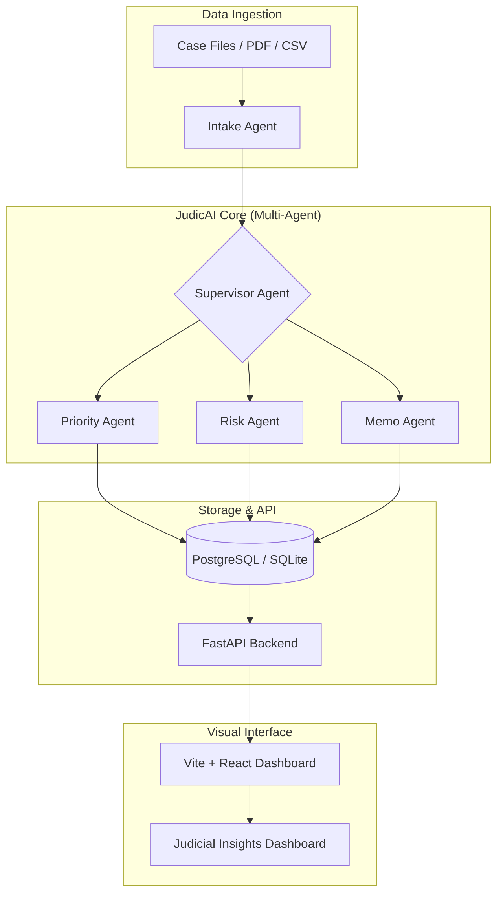

# Paradox (JudicAI) | The Modern Magistrate


[](https://opensource.org/licenses/MIT)
[](https://www.python.org/)
[](https://nodejs.org/)
[](https://fastapi.tiangolo.com/)
[](https://reactjs.org/)
[](https://tailwindcss.com/)

**Paradox (JudicAI)** is a high-fidelity judicial intelligence system engineered for supreme and upper judiciaries. It serves as an **Intelligence Layer** that sits above existing registries to solve systemic backlogs through multi-agent orchestration, predictive risk scoring, and automated scheduling.

---

## 🏛️ Core Vision
The judiciary faces an unprecedented backlog of millions of cases. JudicAI isn't just a management tool; it's a **predictive engine** designed to identify high-risk cases before they stall, ensuring that "Justice Delayed" is no longer the norm.

---

## ✨ Key Intelligence Modules

| Module | Description | Impact |
| :--- | :--- | :--- |
| **⚖️ AI-Priority Registry** | Orchestrates Intake → Priority → Risk agents to rank 1,000+ cases. | Reduces manual sorting by 90% |
| **🔍 Risk Engine** | Predicts adjournment likelihood with an **80% critical risk threshold**. | Proactively flags "Stall Warnings" |
| **📜 Automated Memos** | Generates legal summaries and chamber review memos using LLM orchestration. | Speeds up judge preparation |
| **📅 Smart Allocation** | Dynamically assigns cases based on judge capacity and historical specialization. | Optimizes bench utilization |
| **🌗 Premium UI** | "Deep Ink & Brass" aesthetics providing a professional, distraction-free interface. | Enhanced focus for judicial staff |

---

## 🏗️ System Architecture



---

## 🚀 Getting Started

### 1. Prerequisites
- **Python 3.10+** (Backend)
- **Node.js 18+** (Frontend)
- **PostgreSQL** (Optional, defaults to SQLite)

### 2. Installation & Setup

#### Backend Setup
```bash
cd backend
# 1. Install dependencies
pip install -r requirements.txt

# 2. Configure Environment
# Copy the template and fill in your keys
cp ../.env.example .env

# 3. Launch the API
uvicorn app.main:app --reload
```

#### Frontend Setup
```bash
cd frontend
# 1. Install dependencies
npm install

# 2. Start the Development Server
npm run dev
```

### 3. Database Seeding
Populate the system with a synthetic Supreme Court dataset (100 cases and a full 34-judge bench):
```bash
python scripts/seed_supreme_court.py
```

---

## 🛠️ Tech Stack

- **Intelligence**: LangGraph (Agent Orchestration), Google Gemini / OpenAI Models.
- **Backend**: FastAPI (Python), SQLAlchemy ORM, Pydantic v2.
- **Frontend**: React 18, Vite, Tailwind CSS, Framer Motion (Animations).
- **Visualization**: Recharts, Lucide Icons.
- **Data Engineering**: Pandas, NumPy.

---

## 📂 Project Structure

```text
Paradox/
├── backend/            # FastAPI Application
│   ├── app/            # Core logic, Agents, API, DB
│   └── requirements.txt
├── frontend/           # Vite + React Application
│   ├── src/            # Components, Pages, State
│   └── package.json
├── data/               # CSV datasets and synthetic data
├── scripts/            # Database seeding and utility scripts
├── .env.example        # Environment template
└── Readme.md           # You are here
```

---

## 🤝 Contributing
Contributions are what make the open-source community an amazing place to learn, inspire, and create. Any contributions you make are **greatly appreciated**.

---
*Built with precision for the modern judiciary.*
